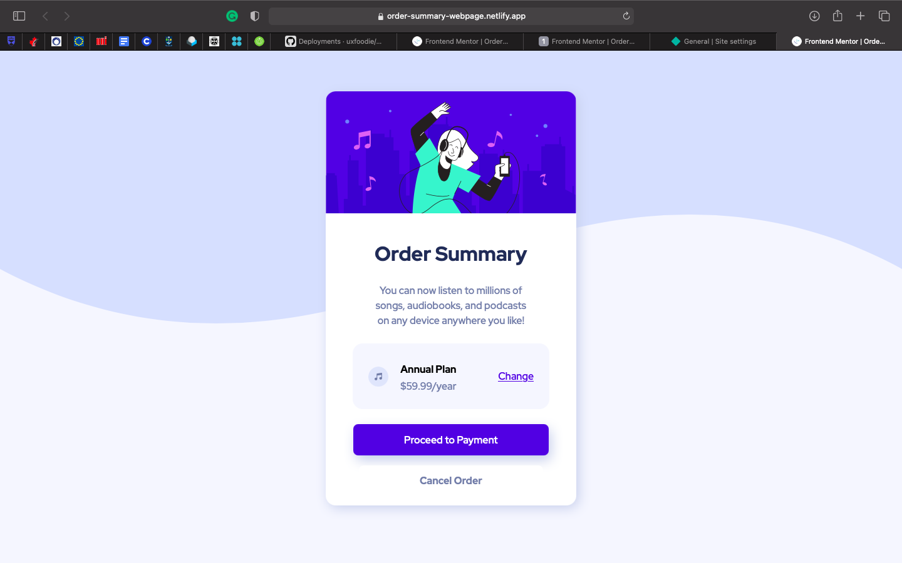
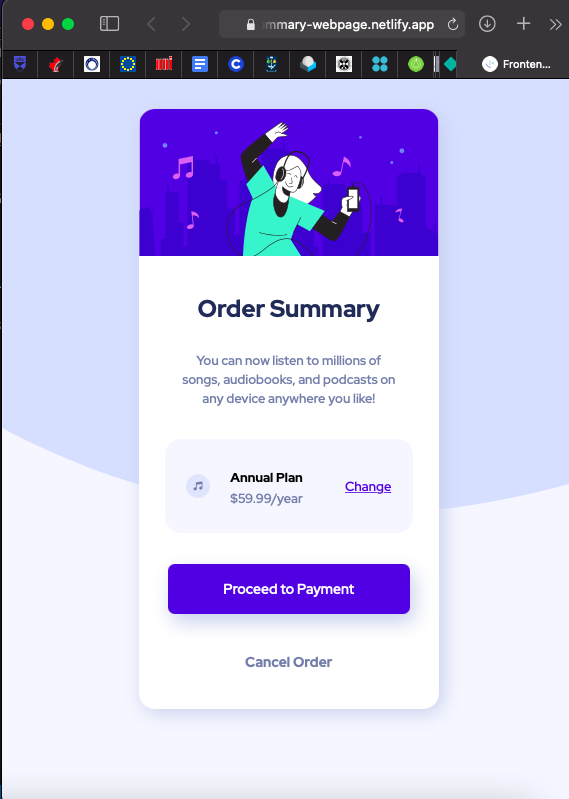
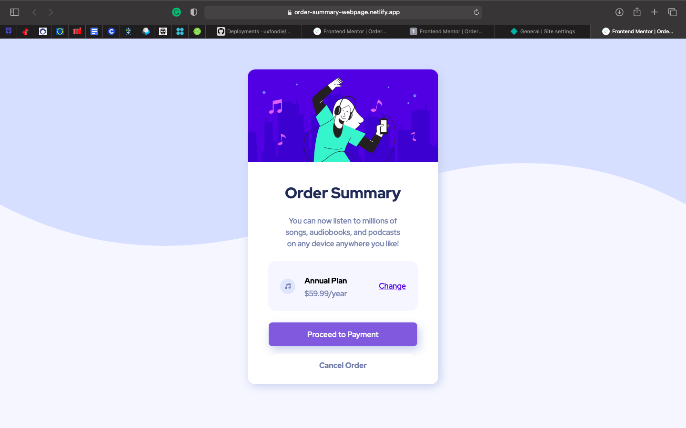

# order-summary-webpage

# Frontend Mentor - Order summary card solution

This is a solution to the [Order summary card challenge on Frontend Mentor](https://www.frontendmentor.io/challenges/order-summary-component-QlPmajDUj). Frontend Mentor challenges help you improve your coding skills by building realistic projects. 

## Table of contents

- [Overview](#overview)
  - [The challenge](#the-challenge)
  - [Screenshot](#screenshot)
  - [Links](#links)
- [My process](#my-process)
  - [Built with](#built-with)
  - [What I learned](#what-i-learned)
  - [Continued development](#continued-development)
  - [Useful resources](#useful-resources)
- [Author](#author)

## Overview

### The challenge

Users should be able to:

- See hover states for interactive elements
- View on mobile and desktop screens

### Screenshot

### Links

- View the live site [here](https://order-summary-webpage.netlify.app)

## My process

### Built with

- Semantic HTML5 markup
- CSS custom properties
- Flexbox
- CSS Grid
- Mobile-first workflow

### What I learned

I learned how to align items and also make the webpage responsive.

### Continued development

I plan to take about 4 more lessons to hone my skills.

# Active button state (on hover)

### Useful resources

- [w3-schools](https://www.w3schools.com) - This helped me align some content using the information on their website. I really liked this site and will use it going forward.

## Author

- My portfolio - [Blessing Ojediran](https://uxfoodie.myportfolio.com)
- Frontend Mentor - [@uxfoodie](https://www.frontendmentor.io/profile/yourusername)
- Twitter - [@uxfoodie_](https://www.twitter.com/yourusername)
